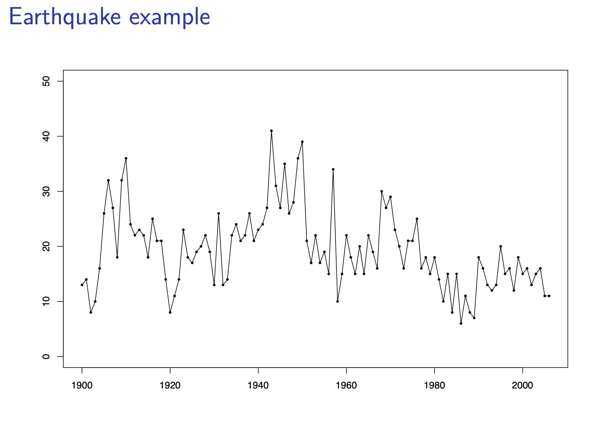
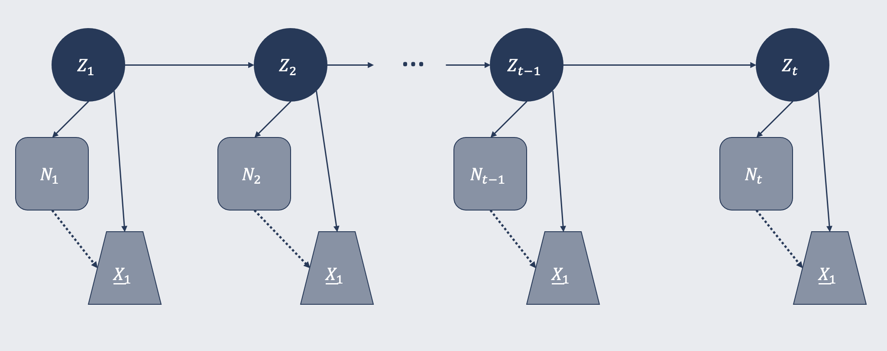
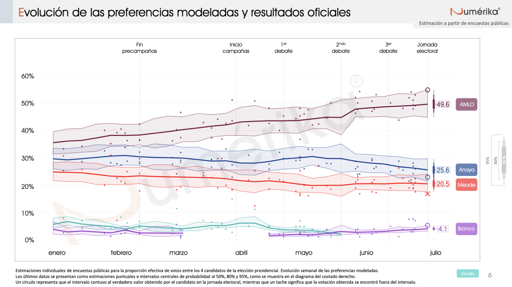
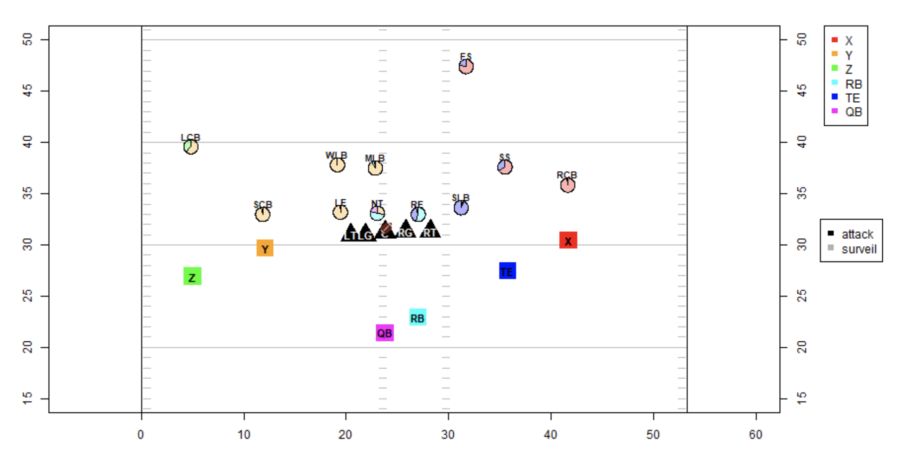

```{r setup, include=FALSE}
options(htmltools.dir.version = FALSE)
knitr::opts_chunk$set(fig.retina = 3, echo=FALSE, warning=FALSE, message = FALSE)
```

```{r xaringan-themer, include=FALSE}
library(xaringanthemer)
style_mono_light(base_color = "#23395b")
```

```{r}
library(tidyverse)
library(DT)
library(MASS)
```

background-image: url(img/zucchini_cover.png)
background-size: 40%

---
class: left, top

# What we were presented with

1. Motivation and definition
2. Likelihood and decoding
3. Parameter estimation

Illustrated by a Poisson HMM for Earthquake data
<br>

```{r out.width = '60%', fig.retina = 3, fig.align='center'}

```

---

# What I want to present today

1. Simple extension to toy data
2. My "own" implementation
3. Model selection
4. Two different Bayesian applications
  - Poll of polls 
  - Defensive coverage in sports

---

# Simulated data

```{r}
lambda <- c(10, 30, 80)
alpha <- c(2, 5, 30)
beta <- c(2, 5, 30)

Gamma <- matrix(data = c(0.8, 0.1, 0.1, 
                         0.35, 0.5, 0.15,
                         0.1, 0.1, 0.8), 
                nrow = 3, byrow = TRUE)

set.seed(051295)
T_max <- 52*5
zeta <- rep(1, T_max)
N <- rep(0, T_max)
N[1] <- rpois(1, lambda[zeta[1]])
for(t in 2:length(zeta)){
  zeta[t] <- sample(c(1,2,3), size = 1, prob = Gamma[zeta[t-1], ])
  N[t] <- rpois(1, lambda[zeta[t]])
}
X <- map(seq_along(N), function(t) rgamma(n = N[t], shape = alpha[zeta[t]], rate = beta[zeta[t]]))
```

.pull-left[
```{r}
map_dfr(seq_along(X),~ tibble(Tiempo = .x, X = X[[.x]])) %>% 
  sample_n(10) %>%
  arrange(Tiempo) %>% 
  datatable(fillContainer = FALSE, options = list(pageLength = 10), height = '1px')
```
]

.pull-right[
```{r datos_1, fig.show = "hide"}
map_dfr(seq_along(X),~ tibble(Tiempo = .x, X = X[[.x]])) %>% 
  ggplot(aes(x = Tiempo, y = X)) + 
  geom_point(size = rel(0.5), alpha = 0.3) + 
  theme_minimal()
```

<br>

```{r ref.label = "datos_1", out.width="90%"}
```
]

---
class: center

# Another way to look at it

```{r graf_freqsev_1, fig.show='hide'}

map_dfr(seq_along(X),~ tibble(t = .x, Severity = sum(X[[.x]]))) %>% 
  mutate(Frequency = N) %>% 
  gather(Variable, Value, -t) %>% 
  ggplot(aes(x=t, y = Value)) + 
  facet_wrap(~Variable, ncol = 1, scales = "free_y") + 
  geom_path() + 
  geom_point() + 
  theme_classic()

```

```{r ref.label = "graf_freqsev_1", out.width="60%"}
```


---

# A "simple" model

We can think of the following simple HMM with two time series, frequency and severity, depending upon the hidden states $Z_t$:

```{r out.width = '90%', fig.retina = 3, fig.align='center'}

```

where at each time $t$

$$N_t | Z_t = z \sim Poi(\lambda_{z})$$

$$X_{i, t} | Z_t = z \sim Gamma(a_{z}, b_{z}) \qquad i=1, 2, \dots, N_t$$


---

# An R implementation

Based on **Zucchini et al.**, particularily their algorithms **A.1.7**, **A.1.8**, and **A.1.9**, I wanted to do my own implementation in R for

- The Forward-Backward algorithm
- EM algorithm (Baum-Welch for HMM)
- Local decoding

---

# Forward probabilites

```{r, echo=TRUE, eval=FALSE}
log_f[[1]] <- dpois(N[1], lambda = l, log = TRUE) + 
  sum(dgamma(X[[1]], shape = a, rate = b, log = TRUE))
foo <- exp(log(d) + log_f[[1]])
sumfoo <- sum(foo)
lscale <- log(sumfoo) 
foo <- foo/sumfoo
lalpha[,1] <- lscale+log(foo)
for (t in 2:T_max){
  log_f[[t]] <- dpois(N[t], lambda = l, log = TRUE) + 
    sum(dgamma(X[[t]], shape = a, rate = b, log = TRUE))
  foo <- foo %*% exp(log(G) + matrix(log_f[[t]], nrow = m, 
                                     ncol = m, byrow = TRUE))
  sumfoo <- sum(foo)
  lscale <- lscale+log(sumfoo)
  foo <- foo/sumfoo
  lalpha[,t] <- log(foo) + lscale
}
```

---

# Backward probabilites

```{r, echo=TRUE, eval=FALSE}
lbeta[, T_max] <- rep(0, m)
foo <- rep(1/m, m)
lscale_b <- log(m)
for(t in (T_max-1):1){
  foo <- G %*% (exp(log_f[[t+1]]) * foo)
  lbeta[, t] <- log(foo) + lscale_b
  sumfoo <- sum(foo)
  foo <- foo/sumfoo
  lscale_b <- lscale_b + log(sumfoo)
}
```

---

# Local decoding

```{r, echo=TRUE, eval=FALSE}
c <- max(lalpha[, T_max])
llk <- c + log(sum(exp(lalpha[, T_max] - c)))
for(t in 1:T_max){
  state_probs[,t] <- exp(lalpha[, t] + lbeta[, t] - llk)
  state_loc_dec[t] <- which.max(state_probs[,t])
}
```

---

# And join these subroutines

in a longer function called *implementa_ajuste*

```{r, echo=TRUE}
implementa_ajuste <- function(N, X, T_max, m, d, G, l, a, b){
  
  # Based on A.1.7, A.1.8, and A.1.9 from Zucchini et al.
  
  lalpha <- matrix(NA, m ,T_max)
  lbeta <- matrix(NA, m, T_max)
  log_f <- rep(list(rep(NA, m)))
  state_probs <- matrix(NA, m, T_max)
  state_loc_dec <- rep(NA, T_max)
  
  # Forward 
  log_f[[1]] <- dpois(N[1], lambda = l, log = TRUE) + 
    sum(dgamma(X[[1]], shape = a, rate = b, log = TRUE))
  foo <- exp(log(d) + log_f[[1]])
  sumfoo <- sum(foo)
  lscale <- log(sumfoo) 
  foo <- foo/sumfoo
  lalpha[,1] <- lscale+log(foo)
  for (t in 2:T_max){
    log_f[[t]] <- dpois(N[t], lambda = l, log = TRUE) + 
      sum(dgamma(X[[t]], shape = a, rate = b, log = TRUE))
    foo <- foo %*% exp(log(G) + matrix(log_f[[t]], nrow = m, ncol = m, byrow = TRUE))
    sumfoo <- sum(foo)
    lscale <- lscale+log(sumfoo)
    foo <- foo/sumfoo
    lalpha[,t] <- log(foo) + lscale
  }
  
  # Backward
  lbeta[, T_max] <- rep(0, m)
  foo <- rep(1/m, m)
  lscale_b <- log(m)
  for(t in (T_max-1):1){
    foo <- G %*% (exp(log_f[[t+1]]) * foo)
    lbeta[, t] <- log(foo) + lscale_b
    sumfoo <- sum(foo)
    foo <- foo/sumfoo
    lscale_b <- lscale_b + log(sumfoo)
  }
  
  
  # Local decoding
  c <- max(lalpha[, T_max])
  llk <- c + log(sum(exp(lalpha[, T_max] - c)))
  for(t in 1:T_max){
    state_probs[,t] <- exp(lalpha[, t] + lbeta[, t] - llk)
    state_loc_dec[t] <- which.max(state_probs[,t])
  }
  
  # Effective number of parameters: Gamma with constrains, delta with constrain, l + a + b
  p <- m*(m-1) + (m-1) + m*3 
  
  # AIC and BIC
  aic <- 2*(-llk + p)
  bic <- -2*llk + p*log(T_max)
  
  # Residuals missing
  
  return(list(log_f = log_f, lalpha = lalpha, lbeta = lbeta, llk = llk, 
              states_loc_dec = state_loc_dec, state_probs = state_probs, 
              aic = aic, bic = bic))
  
}
```


---

## E-step

```{r, echo=TRUE}
implementa_paso_e <- function(N, X, T_max, m, d, G, l, a, b){
  
  # Fit model given the current estimators of the parameters
  ajuste <- implementa_ajuste(N = N, X = X, T_max = T_max, m = m, 
                              d = d, G = G, l = l, a = a, b = b)
  
  # Expectation for state indicators (conditional on current values)
  u_e <- ajuste$state_probs
  
  # Expectation for transition indicators (conditional on current values)
  v_e <- rep(list(matrix(NA, nrow = m, ncol = m)), T_max)
  c <- max(ajuste$lalpha[, T_max])
  llk <- c + log(sum(exp(ajuste$lalpha[, T_max] - c)))
  for(t in 2:T_max){
    for(j in 1:m){
      for(k in 1:m){
        v_e[[t]][j,k] <- exp(ajuste$lalpha[j, t-1] + 
                               log(G[j,k]) + 
                               ajuste$log_f[[t]][k] + 
                               ajuste$lbeta[k, t] - 
                               llk)
      }
    }
  }
  
  return(list(u_e = u_e, v_e = v_e, ajuste = ajuste))
    
}
```

---

# M-step

```{r}
implementa_paso_m <- function(u_e, v_e, a, b, N, X, T_max, m){
  
  # delta
  d_e <- u_e[,1]
  
  # Gamma
  G_e <- matrix(0, ncol = m, nrow = m)
  for(j in 1:m){
    for(k in 1:m){
      for(t in 2:T_max){
        G_e[j, k] <- G_e[j, k] + v_e[[t]][j,k]
      }
    }
    sum_f <- sum(G_e[j,])
    G_e[j, ] <- exp(log(G_e[j, ]) - log(sum_f))
  }
  
  # lambda
  l_e <- rep(0, m)
  for(j in 1:m){
    l_e[j] <- weighted.mean(N, w = u_e[j,])
  }
  
  # alpha y beta
  a_e <- rep(0, m)
  b_e <- rep(0, m)
  for(j in 1:m){
    optim <- nlm(implementa_dgamma_pond, p = c(log(a[j]), log(b[j])), 
                 u_e_j = u_e[j, ], X = X, N = N)
    a_e[j] <- exp(optim$estimate[1])
    b_e[j] <- exp(optim$estimate[2])
  }
  
  return(list(d_e = d_e, G_e = G_e, l_e = l_e, a_e = a_e, b_e = b_e))
  
}
```

```{r, echo=TRUE, eval=FALSE}
implementa_paso_m <- function(u_e, v_e, a, b, N, X, T_max, m){
  
  # delta
  d_e <- u_e[,1]
  
  # Gamma
  G_e <- matrix(0, ncol = m, nrow = m)
  for(j in 1:m){
    for(k in 1:m){
      for(t in 2:T_max){
        G_e[j, k] <- G_e[j, k] + v_e[[t]][j,k]
      }
    }
    sum_f <- sum(G_e[j,])
    G_e[j, ] <- exp(log(G_e[j, ]) - log(sum_f))
  }
  
  # lambda
  l_e <- rep(0, m)
  for(j in 1:m){
    l_e[j] <- weighted.mean(N, w = u_e[j,])
  }
```

---

# M-step

```{r, echo=TRUE, eval=FALSE}
# alpha y beta
a_e <- rep(0, m)
b_e <- rep(0, m)
for(j in 1:m){
  optim <- nlm(implementa_dgamma_pond, p = c(log(a[j]), log(b[j])), 
               u_e_j = u_e[j, ], X = X, N = N)
  a_e[j] <- exp(optim$estimate[1])
  b_e[j] <- exp(optim$estimate[2])
}

return(list(d_e = d_e, G_e = G_e, l_e = l_e, a_e = a_e, b_e = b_e))

}
```

---

# M-step
```{r, echo=TRUE}
implementa_dgamma_pond <- function(theta, u_e_j, X, N){
  
  log_ver <- 0
  a_tilde <- exp(theta[1])
  b_tilde <- exp(theta[2])
  for(t in seq_along(X)){
    log_ver <- log_ver + 
      u_e_j[t]*sum(dgamma(X[[t]], 
                          shape = a_tilde, 
                          rate = b_tilde, 
                          log = TRUE))
  }
  return( -log_ver )
  
}
```

```{r}
implementa_em <- function(N, X, T_max, m, n_iter, 
                          d_0, G_0, l_0, a_0, b_0){
  
  resul <- list(rep(list(NULL), n_iter))
  
  # Initialize
  paso_e <- implementa_paso_e(N = N, X = X, T_max = T_max, 
                              m = m, 
                              d = d_0, G = G_0, l = l_0, a = a_0, b = b_0)
  resul[[1]] <- implementa_paso_m(u_e = paso_e$u_e, v_e = paso_e$v_e, 
                                  a = a_0, b = b_0, 
                                  N = N, X = X, T_max = T_max, m = m)
  
  for(i in 2:n_iter){
    paso_e <- implementa_paso_e(N = N, X = X, T_max = T_max, 
                                m = m, 
                                d = resul[[i-1]]$d_e, 
                                G = resul[[i-1]]$G_e, 
                                l = resul[[i-1]]$l_e, 
                                a = resul[[i-1]]$a_e, 
                                b = resul[[i-1]]$b_e)
    resul[[i]] <- implementa_paso_m(u_e = paso_e$u_e, v_e = paso_e$v_e, 
                                    a = resul[[i-1]]$a_e, b = resul[[i-1]]$b_e, 
                                    N = N, X = X, T_max = T_max, m = m)
  }
  
  return(resul)
  
}
```

---

# Now we're ready to fit, but how many states?

We will try $m=2, 3, \dots, 6$ and then perform model selection with the two common meassures AIC and BIC. 

$$ AIC = 2(-l + p)$$ 
where $l$ is the log-likelihood and $p$ the number of parameters, which depends on $m$. 

$$ BIC = -2l + p\log(T)$$ 
where $T$ is the number of observations, $p$, $l$ are the same as with AIC. 

```{r}
implementa_proceso <- function(N, X, T_max, m, iter_em){
  
  # Heuristic for starting values
  Naive <- tibble(Tiempo = 1:T_max, N = N) %>% 
    arrange(N) %>% 
    mutate(Z_naive = floor(m*row_number()/n()) + 1) %>% 
    mutate(Z_naive = if_else(Z_naive > m, m, Z_naive)) %>% 
    split(.$Z_naive) %>% 
    map_dfr(~ pull(.x,Tiempo) %>% 
              X[.] %>% 
              unlist %>% 
              fitdistr("gamma",start= list(shape = 1, rate = 1)) %>% 
              .$estimate %>% 
              c(z_naive = unique(.x$Z_naive), lambda = mean(.x$N), .))
  
  estima_em <- implementa_em(N = N, X = X, T_max = T_max, 
                             m = m, n_iter = iter_em, 
                             d_0 = rep(1/m, m), 
                             G_0 = matrix(rep(1/m, m^2), ncol = m),
                             l_0 = Naive$lambda, 
                             a_0 = Naive$shape, 
                             b_0 = Naive$rate)
  
  ajuste_final <- implementa_ajuste(N = N, X = X, T_max = T_max, m = m, 
                                    d = estima_em[[iter_em]]$d_e, 
                                    G = estima_em[[iter_em]]$G_e, 
                                    l = estima_em[[iter_em]]$l_e, 
                                    a = estima_em[[iter_em]]$a_e, 
                                    b = estima_em[[iter_em]]$b_e)
  
  return(list(m = m, em = estima_em, ajuste = ajuste_final))
  
}

implementa_graf_em <- function(resul_em, m, lt = 1, verdadero = FALSE){
  
  graf <- map_dfr(seq_along(resul_em), function(i)
    tibble(Iter = i, 
           Param = c(rep("lambda",m),rep("shape",m), rep("rate",m)),
           Estado = rep(1:m,3),
           Estimate = c(resul_em[[i]]$l_e,
                        resul_em[[i]]$a_e,
                        resul_em[[i]]$b_e))) %>% 
    {ggplot(., aes(group = Estado)) + 
        facet_wrap(~Param, scales = "free") + 
        geom_path(aes(x=Iter, y=Estimate, color = as.factor(Estado)), 
                  linetype = lt, show.legend = FALSE) + 
        scale_color_viridis_d(end = 0.8) + 
        theme_classic()}
  
  if(verdadero){
    verdadero <- tibble(Param = c(rep("lambda",3), rep("shape",3), rep("rate",3)),
                        Estado = rep(1:3, 3),
                        Verdadero = c(lambda,alpha,beta))
    
    graf <- graf + geom_hline(data = verdadero, aes(yintercept = Verdadero, color = as.factor(Estado)), show.legend = FALSE)
  }
  
 return(graf)
  
}

hmm_2 <- implementa_proceso(N = N, X = X, T_max = T_max, m = 2, iter_em = 50)
hmm_3 <- implementa_proceso(N = N, X = X, T_max = T_max, m = 3, iter_em = 50)
hmm_4 <- implementa_proceso(N = N, X = X, T_max = T_max, m = 4, iter_em = 50)
hmm_5 <- implementa_proceso(N = N, X = X, T_max = T_max, m = 5, iter_em = 50)
hmm_6 <- implementa_proceso(N = N, X = X, T_max = T_max, m = 6, iter_em = 50)

```

---
class: center

# 2 states

```{r graf_2_estados, fig.show='hide'}
implementa_graf_em(hmm_2$em, 2)
```

```{r ref.label = "graf_2_estados", out.width="60%"}
```

---
class: center

# 3 states

```{r graf_3_estados, fig.show='hide'}
plot(implementa_graf_em(hmm_3$em, 3))
```

```{r ref.label = "graf_3_estados", out.width="60%"}
```

---
class: center

# 4 states

```{r graf_4_estados, fig.show='hide'}
plot(implementa_graf_em(hmm_4$em, 4))
```

```{r ref.label = "graf_4_estados", out.width="60%"}
```

---
class: center

# 5 states

```{r graf_5_estados, fig.show='hide'}
plot(implementa_graf_em(hmm_5$em, 5))
```

```{r ref.label = "graf_5_estados", out.width="60%"}
```

---
class: center

# 6 states

```{r graf_6_estados, fig.show='hide'}
plot(implementa_graf_em(hmm_6$em, 6))
```

```{r ref.label = "graf_6_estados", out.width="60%"}
```

---
class: center

# AIC and BIC

```{r graf_aic_bic, fig.show='hide'}
tibble(m = 2:6, 
       AIC = map_dbl(list(hmm_2,hmm_3,hmm_4,hmm_5,hmm_6),~.x$ajuste$aic),
       BIC = map_dbl(list(hmm_2,hmm_3,hmm_4,hmm_5,hmm_6),~.x$ajuste$bic)) %>% 
  gather(Measure,Value,-m) %>% 
  ggplot(aes(x=m, y = Value, group = Measure, color = Measure)) + 
  geom_path() + 
  geom_point() + 
  ggrepel::geom_label_repel(aes(label = round(Value)), size = rel(3)) + 
  scale_color_viridis_d(option = "F", end = 0.8) + 
  theme_minimal()
```

```{r ref.label="graf_aic_bic", out.width="60%"}

```

---
class: center

# What was the truth? 

In fact, the true data generating process had only 3 states, represented in these plots by the solid lines: 

.pull-left[
```{r graf_3_estados_ver, fig.show='hide'}
plot(implementa_graf_em(hmm_3$em, 3, lt = 2, verdadero = TRUE))
```

```{r ref.label = "graf_3_estados_ver", out.width="80%"}
```
]

.pull-right[
```{r graf_4_estados_ver, fig.show='hide'}

verdadero <- tibble(Param = c(rep("lambda",3), rep("shape",3), rep("rate",3)),
                        Estado = rep(1:3, 3),
                        Verdadero = c(lambda,alpha,beta))

map_dfr(seq_along(hmm_4$em), function(i)
    tibble(Iter = i, 
           Param = c(rep("lambda",4),rep("shape",4), rep("rate",4)),
           Estado = rep(1:4,3),
           Estimate = c(hmm_4$em[[i]]$l_e,
                        hmm_4$em[[i]]$a_e,
                        hmm_4$em[[i]]$b_e))) %>% 
    ggplot(aes(group = Estado)) + 
        facet_wrap(~Param, scales = "free") + 
        geom_path(aes(x=Iter, y=Estimate), linetype = 2, show.legend = FALSE) + 
        geom_hline(data = verdadero, aes(yintercept = Verdadero, color = as.factor(Estado)), show.legend = FALSE) + 
        scale_color_viridis_d(end = 0.8) + 
        theme_classic()

```

```{r ref.label = "graf_4_estados_ver", out.width="80%"}
```
]

---
class: center

# With a clearer distinction

```{r}
lambda <- c(10, 120, 240)
alpha <- c(2, 15, 30)
beta <- c(2, 15, 30)

Gamma <- matrix(data = c(0.8, 0.1, 0.1, 
                         0.35, 0.5, 0.15,
                         0.1, 0.1, 0.8), 
                nrow = 3, byrow = TRUE)

set.seed(051295)
T_max <- 52*5
zeta <- rep(1, T_max)
N <- rep(0, T_max)
N[1] <- rpois(1, lambda[zeta[1]])
for(t in 2:length(zeta)){
  zeta[t] <- sample(c(1,2,3), size = 1, prob = Gamma[zeta[t-1], ])
  N[t] <- rpois(1, lambda[zeta[t]])
}
X <- map(seq_along(N), function(t) rgamma(n = N[t], shape = alpha[zeta[t]], rate = beta[zeta[t]]))

```

```{r graf_freqsev_2, fig.show='hide'}

map_dfr(seq_along(X),~ tibble(t = .x, Severity = sum(X[[.x]]))) %>% 
  mutate(Frequency = N) %>% 
  gather(Variable, Value, -t) %>% 
  ggplot(aes(x=t, y = Value)) + 
  facet_wrap(~Variable, ncol = 1, scales = "free_y") + 
  geom_path() + 
  geom_point() + 
  theme_classic()

```

```{r ref.label = "graf_freqsev_2", out.width="60%"}
```

---
class: center

# And redoing all the process

```{r}
hmm_2_2 <- implementa_proceso(N = N, X = X, T_max = T_max, m = 2, iter_em = 50)
hmm_3_2 <- implementa_proceso(N = N, X = X, T_max = T_max, m = 3, iter_em = 50)
hmm_4_2 <- implementa_proceso(N = N, X = X, T_max = T_max, m = 4, iter_em = 50)
hmm_5_2 <- implementa_proceso(N = N, X = X, T_max = T_max, m = 5, iter_em = 50)
hmm_6_2 <- implementa_proceso(N = N, X = X, T_max = T_max, m = 6, iter_em = 50)
```


```{r graf_aic_bic_2, fig.show='hide'}
tibble(m = 2:6, 
       AIC = map_dbl(list(hmm_2_2,hmm_3_2,hmm_4_2,hmm_5_2,hmm_6_2),~.x$ajuste$aic),
       BIC = map_dbl(list(hmm_2_2,hmm_3_2,hmm_4_2,hmm_5_2,hmm_6_2),~.x$ajuste$bic)) %>% 
  gather(Measure,Value,-m) %>% 
  ggplot(aes(x=m, y = Value, group = Measure, color = Measure)) + 
  geom_path() + 
  geom_point() + 
  ggrepel::geom_label_repel(aes(label = round(Value)), size = rel(3)) + 
  scale_color_viridis_d(option = "F", end = 0.8) + 
  theme_minimal()
```

```{r ref.label="graf_aic_bic_2", out.width="60%"}

```

---
class: inverse, center, middle

# Additional extensions

---

# Poll of Polls

State-space model fitted via MCMC (Stan). The responses are multinomial counts from surveys, and the hidden/latent states are population preferences. This also incorporates covariates, namely house effects from polling organizations. 

```{r out.width = '90%', fig.retina = 3, fig.align='center'}

```


---

# Poll of Polls

$Y_s \sim Mult(\theta_s, n_s)$

$\eta_{s, c} = \log\left(\dfrac{\theta_{s,c}}{\theta_{s,C}}\right)$
for $c = 1, 2, \dots, C-1$ where $C$ is the number of candidates. 

$\eta_s \sim N(\mu_{t[s]} + \gamma_{h[s]}, V_{h[s]})$
where $t$ denotes the time and $h$ the *house*. 

$\mu_t \sim N(\mu_{t-1}, W) \qquad \mu_0 \sim N(m, W)$. 

Finally, *a priori* distributions were given to the house effects as normals centered at zero and to the variances as Inverse Wisharts. 

---
class: center
# Defensive coverage in sports

.pull-left[

- American Football **Pazdernik, 2017**

```{r out.width = '90%', fig.retina = 3, fig.align='center'}

```

]

.pull-right[

- Basketball  **Ali, 2019** 

<video width="320" height="240">
<source src="media/defense_basket.mp4" type="video/mp4">
</video>

]

---
class: inverse, center, middle

# Thank you