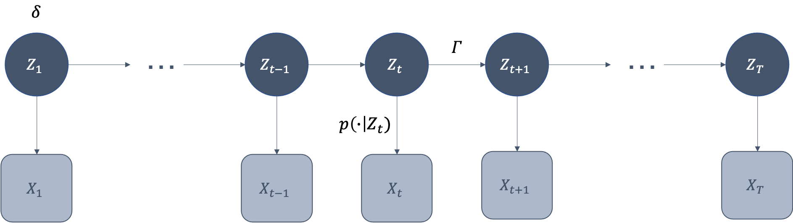

\vspace{-8em}

::: {.center data-latex=""}
Fernando A. Zepeda Herrera (205744)
:::

```{r setup, include=FALSE}
knitr::opts_chunk$set(echo = TRUE)
```

Time series data are ubiquitous. We can think of financial returns, weather measurements at a given location, product purchases, insurance claims, yearly counts of events, etc. Moreover, there are all sorts of data sources or structures that can be naturally expressed as time series even if we may not initially think of them that way: a genetic sequence, an audio where someone speaks, objects or animals moving, sensor data... Faced with this diversity, traditional time series models like ARMA, may be too restrictive in their normality assumption. With this in mind, we would like to have a more flexible statistical modelling framework that could accommodate all these applications. Hidden Markov Models (HMM) provide us with one such framework. The present essay is an attempt to introduce them, based mainly on [@zucchini]. For reasons of space, most results are not proven here, but the interested reader is pointed towards the above reference.

## Hidden States with Markovian transitions

The basic structure of a HMM is illustrated on **Figure 1**, for each observation $X_t$ we introduce a hidden or latent variable $Z_t$ that takes one of $m$ possible values or states that determine its probability law, $X_t \sim p(\cdot|Z_t)$. In turn, the hidden states $\left\lbrace Z_t\right\rbrace_{t=1}^T$ form a Markov chain. That is, starting from a given distribution, $Z_1 \sim \delta$, at each point in time $t=1,\dots, T$ we have that
$$\mathrm{Pr}(Z_{t+1} | Z_{t}, \dots, Z_1) = \mathrm{Pr}(Z_{t+1} | Z_t) \quad \text{ and } \quad X_t \sim p(\cdot|Z_t).$$

Because the state space is finite, we can introduce a one step transition probability matrix $\Gamma$ whose $(i,j)$ entry gives the probability of reaching state $j$ from state $i$, for all combinations of the $m$ states: 
$$\gamma(i,j) := \mathrm{Pr}(Z_{t+1} = j | Z_t = i) \quad\forall\; i,j \in \lbrace 1, 2, \dots, m \rbrace.$$ 

{width=60%}

One could ask why are we introducing these latent variables instead of trying to model the observations directly. There may be several valid answers, but I would like to highlight the following points. With this added structure we are translating the dependencies from the observation level to hidden states, and, in doing so, we are able to propose the elegant dynamics of a relatively simple Markov chain that, as we will see, opens the door to efficient inference algorithms. At the same time, we gain flexibility in specifying the particular form of the distributions of the $X_t$ variables; the state-dependent $p$ distributions may be probability mass functions--- like the Poisson or Negative Binomial--- in case we are trying to model discrete data, but they could also be densities for continuous data. Moreover, in many applications, hidden states become an intuitive theoretical construct; for example, in finance, states may be associated with labels such as periods of high or low volatility, or we may think of them as representing different demand levels in the market.

## Classical inference

In the context of HMM as defined in the previous section we can introduce the following supplemental assumptions and notation to help us do inference. Firstly, we will assume that the observation random variables $X_t$ are discrete, so that $p$ would refer to a probability mass function, but all results are naturally applicable for continuous observational variables. We will consider $X_{s:t} := (X_s, X_{s+1},\dots,X_{t-1},X_t)$ and, analogously for the hidden states, so that, for instance, $Z_{1:t}$ would represent the vector of hidden states from time $1$ to time $t$, both inclusive. The notation applies both to random variables in upper case and realized values in lower case. We can also define a function $P(x)$ whose output is the $m$ x $m$ diagonal matrix with $i$-th diagonal entry $p_i(x) := \mathrm{Pr}(X_t = x | Z_t = i)$, which would not change for $t\geq 2$. 

Now, the likelihood of the full observation vector can be expressed as
$$
L_T := \mathrm{Pr}(X_{1:T} = x_{1:T}) = \sum\limits_{z_1 = 1}^m \cdots \sum\limits_{z_T = 1}^m \left[\delta(z_1) p_{z_1}(x_1) \prod\limits_{t=2}^T \gamma(z_{t-1},z_t)p_{z_t}(x_t)\right],
$$
which may be expressed concisely in matrix notation
$$
L_T = \delta P(x_1) \left[\prod\limits_{t=2}^T \Gamma P(x_t)\right] 1'.
$$

Informally, we can think of the likelihood as alternating Markov transitions of states, $\Gamma$, with *emission probabilities* of observations, $P(x_t)$, starting from the initial distribution over states $\delta$. Furthermore, this also provides an intuition as to how one can accommodate for missing values. Suppose that instead of a fully observed sequence $X_{1:T}$ we had two "disconnected" sequences, $X_{1:s}$ and $X_{s+h:T}$. Then the likelihood would be calculated as 
$$L = \delta P(x_1)\left[\prod\limits_{t=2}^s \Gamma P(x_t)\right] \Gamma^h\left[\prod\limits_{t=s+h}^T \Gamma P(x_t)\right] 1',$$
that is, we insert $h$ Markov transitions without any emissions during the period of $h$ consecutive missing values. 

### Forward and Backward probabilities

An efficient way of computing the likelihood involves the proposal of the following recursive relation: 
$$
\alpha_1:=\delta P(x_1) \quad\text{ and }\quad \alpha_t:=\alpha_{t-1}\Gamma P(x_t) \quad \forall \;t \in \lbrace 2,\dots,T \rbrace,
$$
so that we end up with
$$L_T = \alpha_T 1'.$$
It must be said that it is also possible to omit the $P(x_t)$ factors for those times $t$ where there was a missing value. These $\alpha_t$ vectors are known as **forward probabilities** since it can be shown that their $i$-th elements are
$$\alpha_t(i) = \mathrm{Pr}(X_{1:t} = x_{1:t}, Z_t = i).$$
We can also introduce the so-called **backwards probabilities** vectors, $\beta_t':=\left[\prod\limits_{s=t+1}^T \Gamma P(x_s)\right] 1'$, since their $i$-th elements reflect the following conditional probabilities
$$\beta_t(i) = \mathrm{Pr}(X_{t+1:T} = x_{t+1:T} \;|\; Z_t = i)$$

### Decoding

One first inference problem we could now pose is inferring the most likely hidden state at each point in time, given the observed series. This is called **local decoding** and may be solved making use of the forward and backwards probabilities. Indeed, for each $t\in\lbrace 1,\dots,T\rbrace$ we want to find the state that maximizes $\mathrm{Pr}(Z_t = z \;|\; X_{1:T} = x_{1:T})$. These hidden state probabilities can be computed as$\mathrm{Pr}(Z_t = z \;|\; X_{1:T} = x_{1:T}) = \dfrac{\alpha_t(z)\beta_t(z)}{L_T}$.

A second closely related but slightly different problem is that of **global decoding**; this means finding the most likely joint *sequence* of hidden states instead of considering them one at a time as local decoding would. That is, we want to find the sequence $z_{1:T}$ that maximizes $\mathrm{Pr}(Z_{1:T} = z_{1:t}|X_{1:T} = x_{1:T})$. This sequence would also maximize the joint $\mathrm{Pr}(Z_{1:T} = z_{1:t}, X_{1:T} = x_{1:T})$ and can be found via the so-called Viterbi algorithm, which begins by defining
$$
\begin{aligned}
&\xi_1(z) := \mathrm{Pr}(Z_1 = z, X_1 = x_1) = \delta(z)p_z(x_1) \quad \forall\; z \in \lbrace 1, \dots, m\rbrace\\
&\xi_t(z) := \underset{z_{1:t-1}}{\max} \mathrm{Pr}(Z_{1:t-1} = z_{1:t-1}, Z_t = z, X_{1:t} = x_{1:t}) \quad \forall\; z \in \lbrace 1, \dots, m\rbrace, \; t \in \lbrace 2, \dots, T\rbrace
\end{aligned}
$$
Then, it could be shown that starting with the $\xi_1(z)$ there is a valid recursion $\xi_t(z) = \underset{w}{\max}\left\lbrace\xi_{t-1}(w)\gamma(w,z)\right\rbrace p_z(x_t)$. Finally, the inferred sequence $z_{1:T}^\star$ would be found by another recursion: 
$$
\begin{aligned}
z_T^\star &= \underset{z}{\mathrm{argmax}} \; \xi_T(z)\\
z_t^\star &= \underset{z}{\mathrm{argmax}} \; \xi_t(z)\gamma(z, z_{t+1}^\star) \quad \forall \; t \in \lbrace T-1, \dots, 1 \rbrace
\end{aligned}
$$

### Forecast

If, instead of decoding, we would like to forecast in which state the chain would be $h$ steps into the future, we can readily leverage the forward probabilities: 
$$\mathrm{Pr}(Z_{T+h} = z \;|\; X_{1:T} = x_{1:T}) = \dfrac{\mathrm{Pr}(X_{1:T} = x_{1:T}, Z_{T+h} = z)}{L_T} = \dfrac{\alpha_T \Gamma^h \mathrm{e}_z'}{L_T},$$
where $\mathrm{e}_z'$ is the vector with $z$-th entry 1 and $0$ elsewhere. This expression offers the same sort of intuition as the missing data likelihood. Once we have computed the last forward probability we make $h$ Markov transitions to arrive at the given future state. What is more, if we would like to predict not the state but a future observation, we would have: 
$$\mathrm{Pr}(X_{T+h} = x \;|\; X_{1:T} = x_{1:T}) = \dfrac{\mathrm{Pr}(X_{1:T} = x_{1:T}, X_{T+h} = x)}{L_T} = \dfrac{\alpha_T \Gamma^h P(x) 1'}{L_T},$$
informally substituting the "selection" of a given state $z$, via $\mathrm{e}_z'$, by the given emission probability step $P(x) 1'$.

### EM algorithm

Now, in order to use all the preceding formulas, we would need to fully know $\delta$, $\Gamma$, and all the parameters that would identify the state-dependent distributions $p_z(\cdot)$. However, when confronted with a given application, they would usually be unknown to us and we would need to estimate them. One way of doing this is with maximum likelihood estimators, obtained by an algorithm specifically designed for contexts where some data is missing: the EM Algorithm. In the case of HMM the missing data would refer to the hidden unobserved states. 

For a first-level introduction, justification, and illustration of the EM Algorithm, the interested reader may consult [@cristy]. Here it would suffice to say that it consists of iteratively alternating until convergence two different steps: the E step and the M step. Starting with initial values $\theta$ for the parameters we would like to estimate, in the **E step** we compute the conditional *Expectations* of functions of missing data appearing in the so-called **complete-data log-likelihood** (CDLL). Next, the **M-step** consists of *Maximizing* with respect to $\theta$ the CDLL evaluated at the expectations computed in the previous E-step and using the resulting optimized $\theta^\star$ values in the next E-step.

For HMM, we have that $CDLL = \log\left[\mathrm{Pr}(X_{1:T} = x_{1:T}, Z_{1:T} = z_{1_T})\right] = \log\left[ \delta(z_1) \left(\prod\limits_{t=2}^T \gamma(z_{t-1}, z_t)\right) \left(\prod\limits_{t=1}^T p_{z_t}(x_t)\right)\right]$. We also introduce the following indicator functions to be used on the EM algorithm, $u_i(t) :=  1$ only when $z_t = i$ and $v_{i,j}(t) := 1$ only when both $z_{t-1} = i$ and $z_t = j$ occur. Then,  we could express the CDLL as
$$
\begin{aligned}
CDLL &= \log\left(\left[ \prod\limits_{i=1}^m \delta(i)^{u_i(1)}\right]  \left[ \prod\limits_{i=1}^m \prod\limits_{j=1}^m \prod\limits_{t=2}^T \gamma(i, j)^{v_{i,j}(t)}\right] \left[ \prod\limits_{i=1}^m \prod\limits_{t=1}^T p_{j}(x_t)^{u_i(t)}\right] \right)\\
&=\left[\sum\limits_{i=1}^m u_i(1)\log(\delta(i))\right] + \left[\sum\limits_{i=1}^m\sum\limits_{j=1}^m \log(\gamma(i,j)) \sum\limits_{t=2}^T v_{i,j}(t)\right] + \left[\sum\limits_{i=1}^m\sum\limits_{t=1}^T u_i(t)\log(p_i(x_t))\right]
\end{aligned}
$$

From this CDLL, that depends on the hidden states through the $u$'s and $v's$, the E-step would require to compute for all indices $i, j\in \lbrace 1,\dots,m\rbrace$ and $t\in\lbrace 1, \dots, T\rbrace$:
$$
\begin{aligned}
\hat{u}_i(t) &= E[u_i(t) \;|\; X_{1:T} = x_{1:T}] = \mathrm{Pr}(Z_t = i \;|\; X_{1:T} = x_{1:T}) = \hat{\alpha}_t(j)\hat{\beta}_t(j)\hat{L}_T^{-1}\\
\hat{v}_{i,j}(t) &= E[v_{i,j}(t) \;|\; X_{1:T} = x_{1:T}] = \mathrm{Pr}(Z_{t-1} = i, Z_t = j \;|\; X_{1:T} = x_{1:T}) = \hat{\alpha}_{t-1}(i)\hat{\gamma}(i,j)\hat{p}_j(x_t)\hat{\beta}_t(j)\hat{L}_T^{-1}
\end{aligned}
$$
where the hat notation reminds us that all these quantities are estimators given the current proposed values for all the parameters. 

Then, for the M-step we would need to maximize the CDLL for $\delta$, $\Gamma$ and the parameters of all the $p_z(\cdot)$, after substituting these estimators derived in the E-step. This may sound as a complex optimization problem but note how the CDLL decomposes in three summation terms, each depending on a single subset of parameters. Thus, the maximization may be split in simpler optimization sub-problems. For instance, we would have in general that for all $i, j \in \lbrace 1,\dots ,m\rbrace$
$$
\delta^\star(i) = \dfrac{\hat{u}_i(1)}{\sum\limits_{k=1}^m\hat{u}_k(1)} \qquad\text{and}\qquad
\gamma^\star(i,j) = \dfrac{\sum\limits_{t=2}^T\hat{v}_{i,j}(t)}{\sum\limits_{k=1}^m \sum\limits_{t=2}^T\hat{v}_{i,k}(t)}
$$
(for a justification please refer to [@zucchini]). Finally, the maximization of the parameters of the $p_z(\cdot)$ would be carried out by optimizing the last term of the CDLL, $\sum\limits_{i=1}^m\sum\limits_{t=1}^T u_i(t)\log(p_i(x_t))$. Depending on the particular model being fitted this could be find in closed form or one would need to resort to numerical optimization. 

# References